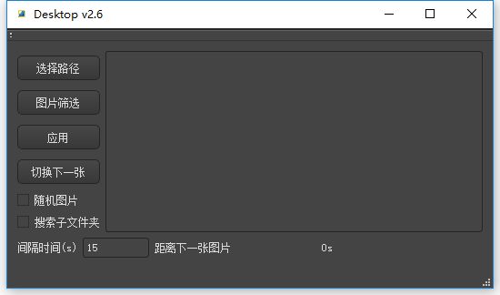

# Desktop
	网上下载了图包，然而并不是每一张都可以做桌面
	
### 界面

	
### 功能
*	修改桌面
*	随机图片
*	搜索子文件夹
*	定时切换/停止切换
*	桌面托盘
	
### 使用方式
下载release，解压，运行其中exe文件即可
源码在code文件夹
编译时出现 undefined reference to ... 时可以在release或debug文件夹内moc_mainwindow.cpp中的switch case部分找到这个按钮并注释掉即可

### 其他
	qss样式来源 http://www.qtcn.org/bbs/read-htm-tid-63012.html
	