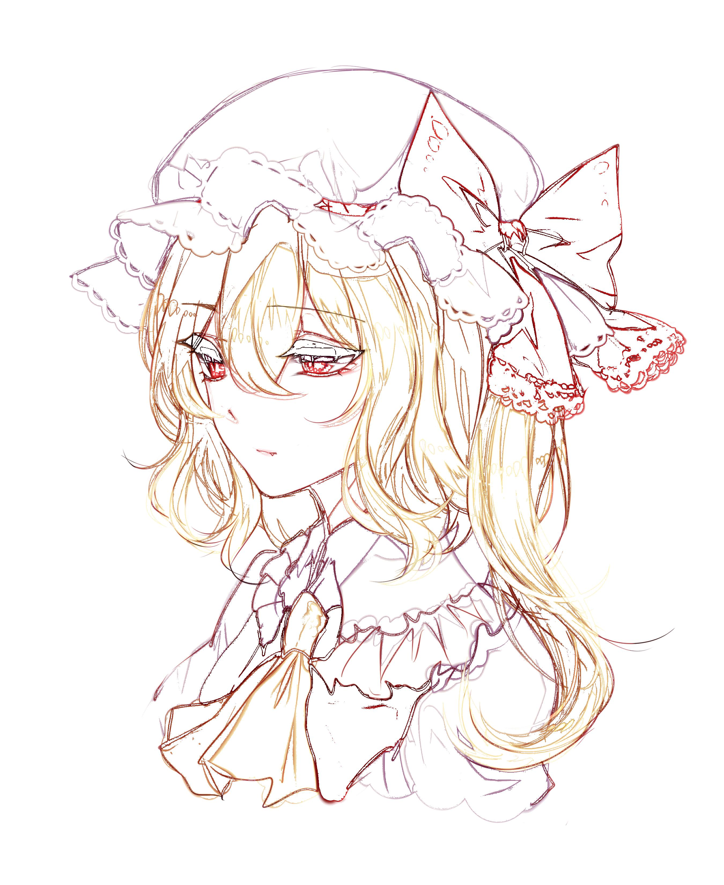

# Sketch-Converter
	给你的图片换个画风

开发环境`Win10`,`Qt5.8.0`
	
偶然产生的想法……效果直接上图
	
	

### 使用方式
在release文件夹或者release中下载后运行exe文件即可

### 注意事项	
支持拖入图片，保存时需要手动加上后缀名
一般参数选择5-25效果最好
编译时出现 undefined reference to ... 时可以在release或debug文件夹内moc_mainwindow.cpp中的switch case部分找到这个按钮并注释掉即可
	
	qss样式来源
	http://www.qtcn.org/bbs/read-htm-tid-63012.html

	
### 其他
	分辨率越高效果越好
	对于三次元图片效果较差
	
	